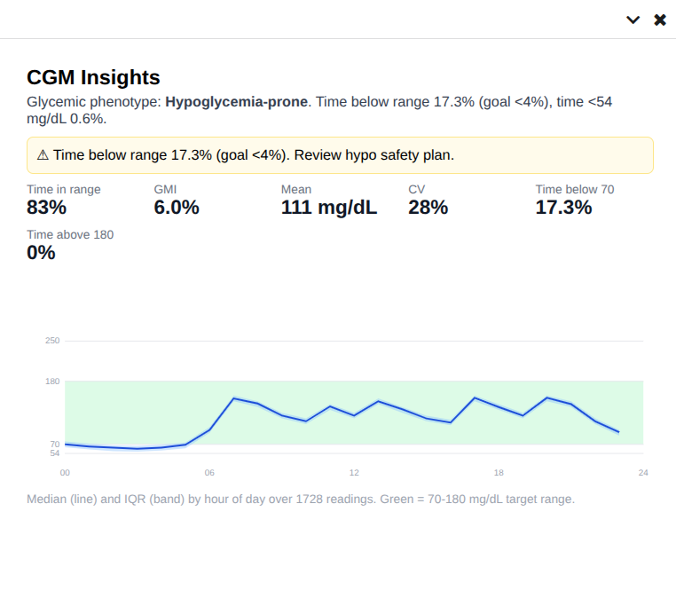

# cgm_insights

A [Canvas Medical](https://www.canvasmedical.com/) plugin that turns continuous
glucose monitor (CGM) data from [Nightscout](https://nightscout.github.io/) into
clinical decision support inside the EHR: an AGP-style summary display, glycemic
phenotype triage, and (milestone 2) the documentation needed to drive CGM/RPM
reimbursement.

This is an open-source portfolio piece. It demonstrates platform fluency and
clinical judgment, descriptive analytics and triage, not unvalidated dosing
recommendations. The heavier statistical pipeline (settings extraction and
parameter recommendation) is intentionally deferred to an external service
("Phase 2 / sidecar"); see [`docs/plan.html`](docs/plan.html) for the full
feasibility analysis and architecture.



> The **CGM Insights** application running live in a Canvas sandbox (demo mode):
> phenotype triage, hypoglycemia-safety banner, time-in-range metrics, and the
> AGP chart — rendered from synthetic, de-identified data.

## What it does (Milestone 1)

- **CGM summary display** — an Ambulatory Glucose Profile (AGP) chart and the
  standard metrics (Time in Range, GMI, %CV, time below/above range) rendered as
  a custom patient-chart section.
- **Glycemic phenotype triage** — classifies each patient as hypoglycemia-prone,
  hyperglycemia-prone, high-variability, or at-goal, surfaced as a Canvas
  `ProtocolCard`, with a hypoglycemia-safety `BannerAlert` when warranted.

## Architecture

```
Nightscout API  ->  cgm_insights.core (pure Python, SDK-free)  ->  Canvas effects
   (entries)          metrics / triage / AGP rendering             ProtocolCard
                                                                    BannerAlert
                                                                    Custom section
```

Two design rules make this work and keep it testable:

1. **All logic lives in `cgm_insights/core/`** and is dependency-free pure Python
   using only the subset of builtins the Canvas RestrictedPython sandbox allows
   (no numpy/scipy/pandas/math). It is unit-tested with plain pytest.
2. **`cgm_insights/handlers/` is thin glue** — it fetches Nightscout data via the
   Canvas SDK `Http` client, calls `core`, and returns Canvas effects.

## Layout

```
cgm_insights/            # installable Canvas plugin
  CANVAS_MANIFEST.json
  core/                  # SDK-free: nightscout, metrics, triage, agp, ns_client
  handlers/              # thin Canvas event handlers
fixtures/                # synthetic, de-identified Nightscout data + generator
tests/                   # pytest suite (core + handler layers)
docs/plan.html           # feasibility analysis & architecture
```

## Development

```bash
python -m venv .venv && source .venv/bin/activate
pip install -e '.[dev]'        # pytest; the SDK-free core needs no deps
python -m fixtures.generate    # (re)write synthetic fixtures
pytest                         # run the suite
```

## Trying it out / manual testing

Three ways to exercise it, from quickest to most realistic.

**1. Visual preview (no Canvas, no network).** Renders the in-Canvas output
(AGP chart, triage, billing readiness) for every synthetic phenotype:

```bash
python -m scripts.preview          # writes docs/preview.html
# open docs/preview.html in a browser
```

**2. Run the pipeline manually (CLI).** Exercises the exact core the plugin
uses and prints metrics, triage, and the Canvas effects it would emit:

```bash
# against a bundled synthetic fixture:
python -m scripts.run --fixture hypo_prone --effects

# against YOUR live Nightscout instance (reads + displays locally only;
# nothing is written to Canvas, so no PHI is moved anywhere):
python -m scripts.run --url https://your-ns.example --token YOUR_READ_TOKEN

# also write an AGP HTML preview of that data:
python -m scripts.run --fixture at_goal --html /tmp/out.html
```

**3. Install into a Canvas sandbox (end-to-end).** Requires the Canvas CLI and
a configured instance (`~/.canvas/credentials.ini`). Use a **de-identified**
Nightscout source, since data written into Canvas must not contain PHI.

The one value that cannot be inferred is your Canvas instance **subdomain**
(for `https://acme-dev.canvasmedical.com` it is `acme-dev`). The
`credentials.ini` section name must equal that subdomain, and the keys must be
`client_id` / `client_secret`. A helper handles the section naming and install:

```bash
pip install canvas
# <subdomain> is required; Nightscout args are optional (set later if omitted):
scripts/install_to_sandbox.sh <subdomain> [nightscout_url] [nightscout_token]
```

Or do it manually:

```bash
canvas validate-manifest cgm_insights
canvas install cgm_insights --host <subdomain> \
  --variable NIGHTSCOUT_URL=https://your-ns.example \
  --variable NIGHTSCOUT_TOKEN=your-read-token
canvas logs --host <subdomain>     # stream plugin logs while you interact
```

Then, in the Canvas UI:
- Open a patient chart → the CGM summary custom section renders.
- Create an encounter note (`NOTE_STATE_CHANGE_EVENT_CREATED`) → the phenotype
  triage ProtocolCard (+ hypo banner) appears, and, when the patient's CGM data
  is sufficient, the billing-readiness card.

### Where it appears in Canvas

After install, the plugin surfaces in a few places:

| What | Where to find it |
| --- | --- |
| **"CGM Insights" launcher (global)** | The top-level **app drawer** (same place as other global apps). Opens the CGM view as a full page. |
| **"CGM Insights" launcher (patient)** | A patient chart's **app drawer** (open a patient first). Opens the CGM view in a right-hand pane. |
| **Triage card + hypo banner + billing card** | Open a patient and **create an encounter note** (`NOTE_STATE_CHANGE_EVENT_CREATED`). |
| **Handler activity / logs** | `canvas logs --host <subdomain>` while you interact. |
| **Plugin + config** | Admin/Settings → Extensions/Plugins → `cgm_insights` (set `DEMO_MODE` / `NIGHTSCOUT_URL`). |

With `DEMO_MODE=1`, all of the above render from synthetic data (no Nightscout, no PHI). You may need to refresh the Canvas page after (re)installing for new launchers to appear.

### Demo mode (see output without a real Nightscout)

To exercise the plugin in a sandbox **without configuring Nightscout and without
moving any PHI into Canvas**, enable demo mode — it feeds bundled, deterministic
**synthetic** series:

```bash
canvas config set cgm_insights DEMO_MODE=1 --host <subdomain>
```

Now creating an encounter note for any patient renders the triage card, the
hypo-safety banner, and the billing-readiness card (CPT 95251 + 99454) from
synthetic data. Watch it with `canvas logs --host <subdomain>`. Turn it off with
`canvas config set cgm_insights DEMO_MODE= --host <subdomain>`.

**See every phenotype:** the global **"CGM Insights"** app (top-level app drawer)
opens a **cohort gallery** rendering all eight demo phenotypes (at-goal,
hyperglycemia-prone, hypoglycemia-prone, high-variability, dawn-phenomenon,
post-meal-spiker, nocturnal-hypo, well-controlled-AID) as AGP charts with their
triage. To make the single-patient views show a specific phenotype instead of the
default, set `DEMO_MODE` to its name:

```bash
canvas config set cgm_insights DEMO_MODE=high_variability --host <subdomain>
```

> Note: the CGM **chart-summary section** additionally requires registering the
> section into the chart layout (`SHOW_PATIENT_CHART_SUMMARY_SECTIONS`), which
> replaces the layout globally; it is intentionally left out so the plugin does
> not alter shared-instance chart layouts. Instead, the plugin registers
> **Applications** ("CGM Insights") — launcher icons (patient chart and global
> app drawer) that open the views without touching the global layout.


## Data & privacy

- The repository ships **only de-identified** CGM fixtures (`fixtures/synthetic/`).
  They are **hybrid**: fuzzed real CGM days (date-shifted, value-jittered,
  metadata-stripped, blended across ≥2 patients for k-anonymity) stitched with
  synthetic days from a physiological model, plus fully-synthetic scenarios. Raw
  patient data stays external and is never committed. See
  [`fixtures/FIXTURES.md`](fixtures/FIXTURES.md) for the de-identification method
  and provenance; `tests/test_fixture_safety.py` enforces the no-PHI guarantees.
- The plugin does **not** mirror the raw 5-minute glucose stream into Canvas.
  Milestone 2 writes only low-cardinality summary `Observation`s and a
  `DocumentReference` report, the artifacts that support CPT 95251 / RPM billing.

## Status

- [x] **M1** — Nightscout fetch, pure-Python metrics, AGP display, phenotype triage
- [x] **M2** — billing-readiness documentation (summary Observations, review/sign card, data-sufficiency gates for CPT 95251 / 99454)
- [ ] **M3** — external sidecar for settings extraction / parameter recommendation

A static render of the in-Canvas output for each synthetic phenotype is in
[`docs/preview.html`](docs/preview.html) (regenerate with `python -m scripts.preview`).

## License

MIT — see [LICENSE](LICENSE).
